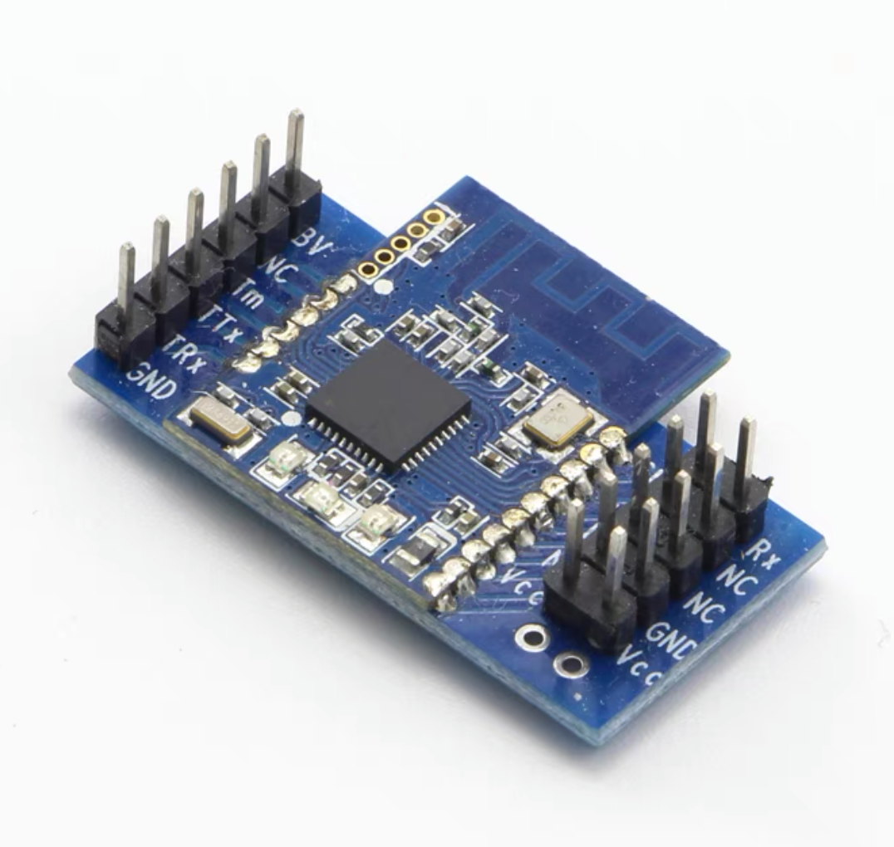
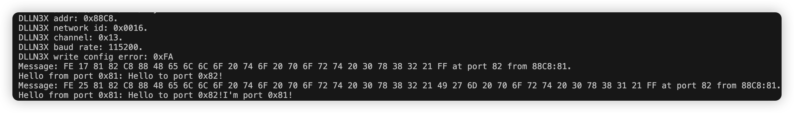

# DLLN3X_zigbee_mesh_module_library

    

DL-LN3X模块(基于CC2530)

开发这个库的目的是为了能够更方便地使用DL-LN3X系列紫蜂多跳自组网模块。

这个库已实现厂商文档中提到的所有功能，目前剩下的工作主要是维护和修复，欢迎向我反馈问题。

# 现有功能

1. 基本消息收发。
2. 模块地址读取。
3. 片载LED灯闪烁控制。
4. 模块配置读取、修改 (波特率、地址、信道等)。
5. 模块错误报告读取。
6. 网络链路质量检测。
7. 片上引脚控制。

# 例程运行结果

# 更新日志

**V1.1.6 2024.2.25**

+ 修复允许向模块发送包长超过最大值包的问题（按照官方文档，除去包头、包尾和包长字段，发送数据包含地址、端口信息在内, 最多为63字节)。

**V1.1.5 2024.2.23**

+ 修复包数据结构（ZigbeeFrame）可能会被越界访问的问题。

**V1.1.4 2024.2.1**

+ 修复包数据结构（ZigbeeFrame）可能会被越界访问的问题。

**V1.1.3 2023.5.3**

+ 错误修复，为了兼容尽可能多的板子，使用最小化vector实现（实现来自 [@a6c0424fa083's vector_for_arduino](https://github.com/a6c0424fa083/vector_for_arduino)，我做了很小的改动）以替代标准库实现。

**V1.1.2 2023.4.22**

+ 修改头文件以规避编译出错，加入对不支持标准库实现板子的警告（如果你的板子是Arduino AVR架构的，如Arduino Uno，必须在Arduino库中的'ArduinoSTL/src/new_handler.cpp'文件里注释'const std::nothrow_t std::nothrow = { };'）

**V1.1.1 2023.3.18**

+ 修复没有进行深拷贝的问题。

**V1.1.0 2023.3.18**

+ 完全重构。
+ 加入ZigbeeFrame容器。
+ 大幅提升稳定性。
+ 支持包含配置读取/修改、信道质量检测、片上LED/引脚控制、错误报告在内官方文档提及的所有功能。

**V1.0.4 2023.1.26**

- 错误修复，稳定性提升。

**V1.0.3 2023.1.12**

- 修复例子中存在的问题。

**V1.0.2 2022.12.8**

- 错误修复。
- 支持软串口SoftwareSerial。

**V1.0.1 2022.9.8**

- 错误修复。
- 提升代码可读性。
- 提供更多合适的例子和接口。

**V1.0.0 2022.9.7**

- 初始化代码仓库，还有很多工作未完成。

