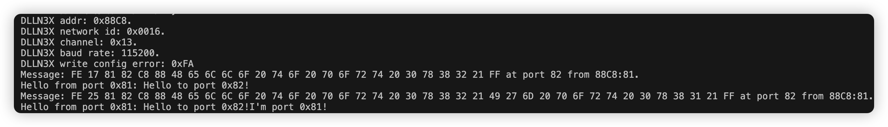

# DLLN3X_zigbee_mesh_module_library
This library allows you to use DLLN3X ZigBee mesh module very easily.

# Available Features

1. Basic message sending and receiving.
2. Module address reading.
3. On-chip red led flashing control.
4. Configuration reading, modification (baud rate, address, etc.).(TODO)
5. Error Report.(TODO)
6. Link quality test.(TODO)
7. On-chip pin control.(TODO)

# Example run results

# Change Log

**V1.0.4 2023.1.26**

- Bug fixes and stability improvements.

**V1.0.3 2023.1.12**

- Bug fixed for example.

**V1.0.2 2022.12.8**

- Bug fixed.
- Add support for SoftwareSerial.

**V1.0.1 2022.9.8**

- Bug fixed.
- Code readability improvement.
- Provide more appropriate examples and interfaces.

**V1.0.0 2022.9.7**

- Initial code, a lot of things need to be improved.

